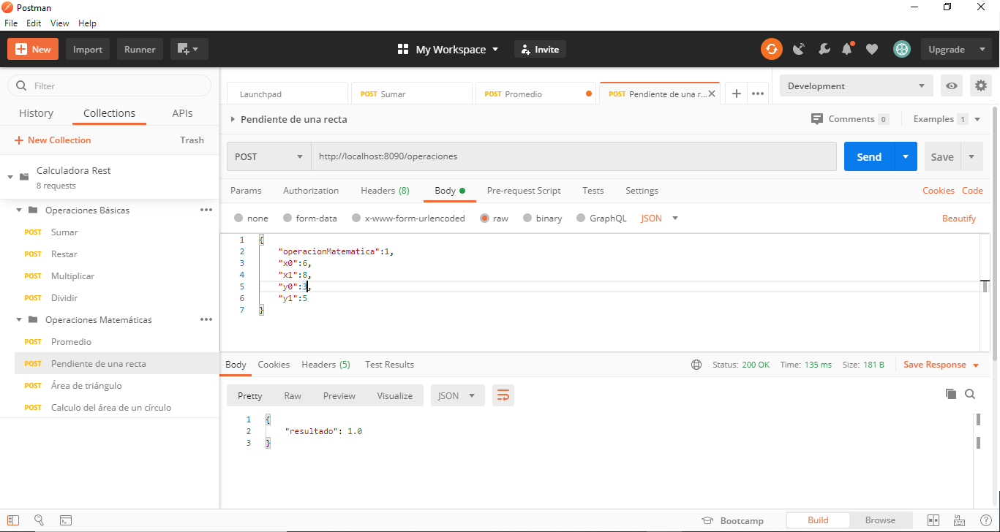
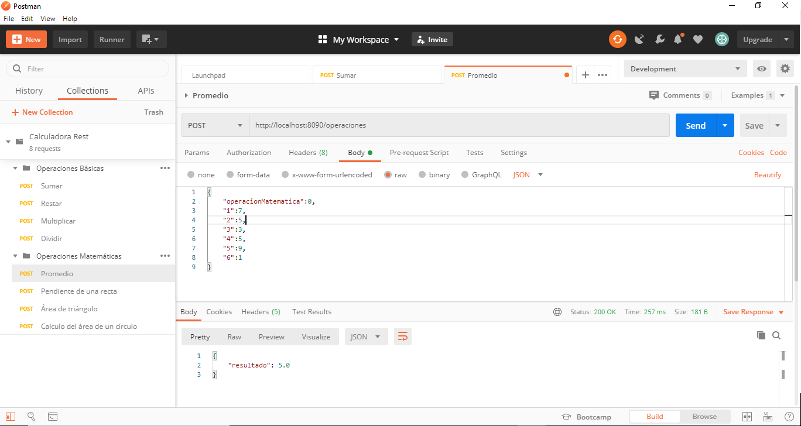
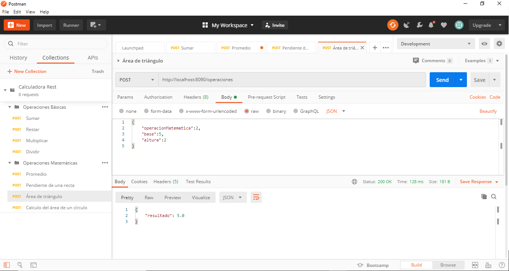
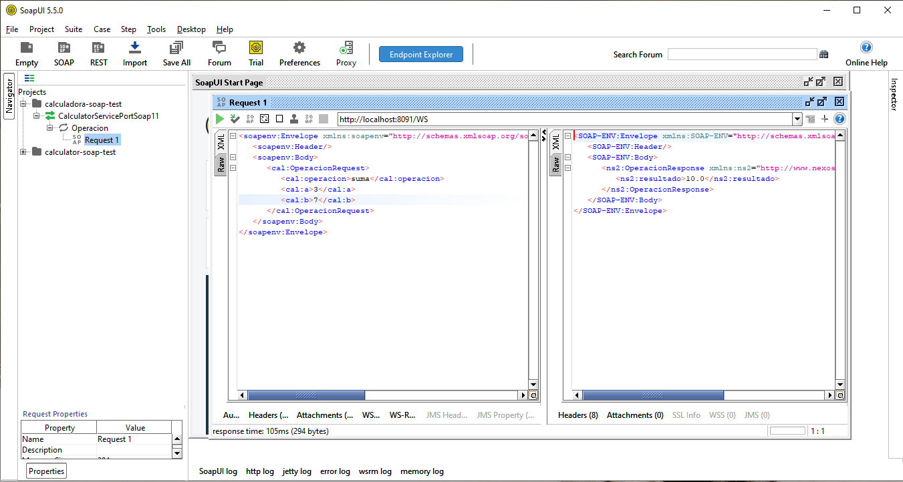
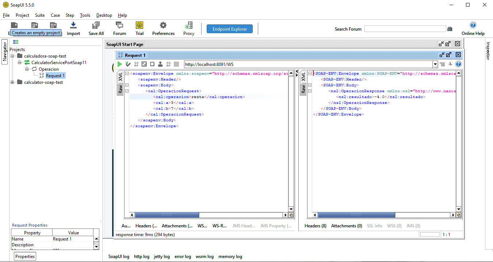
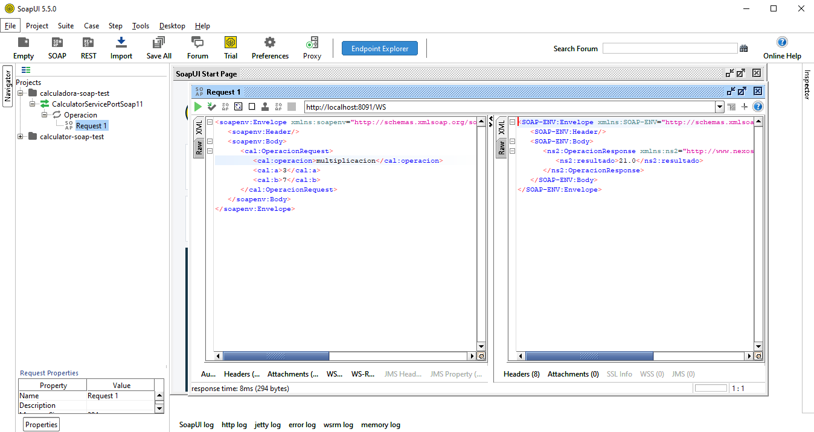
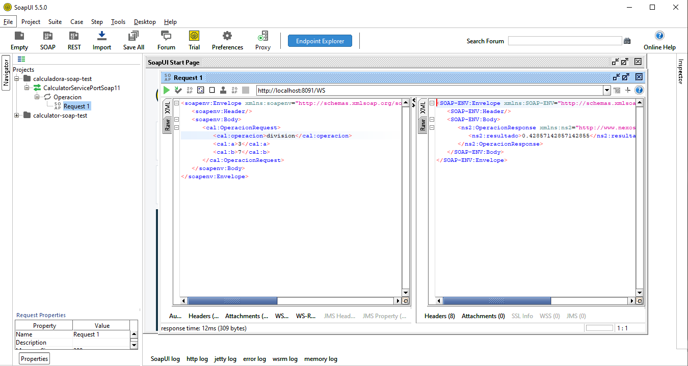

# Calculadora-ws

Calcualdora-ws es un servicio web SOAP que permite realizar las operaciones básicas(suma, resta, multiplicacion y división) y las expone a través de un servicio REST. Además el servicio REST nos añade otras funciones que permiten calcular el promedio de una lista de números, el área de un triángulo, el área de un círculo y la pendiente de una recta.

### Tecnologias usadas

El proyecto se desarrollo sobre el framework de spring boot, maven y jaxb2; las pruebas unitarias se realizarion en Postaman y SoapUI.

### Instalación

1. Descargarel repositorio
2. Importar proyecto Spring boot desde el IDE.
3. Poner en marcha los dos programas.
4. Acceder a los servicios REST através de la IP: http://localhost:8090

### Documentacion REST

La documentacion del servicio REST se encuentra en Postman:
https://documenter.getpostman.com/view/11867770/T17CCpsT?version=latest

### Funcionamiento SOAP-ws

El servicio SOAP esta compuesto por:

1. Un objeto request y uno response que definen los atributos de entrada y salida de la aplicacion SOAP
2. Un servicio que contiene los métodos de suma, resta, multiplicacion y división.
3. Un archivo soapConfig que da los parámetros del archivo wsdl
4. Un archivo endPoint que es el acceso a la applicación.

### Funcionamiento Cliente SOAP

El proyecto spring-boot-calculadora-ws-cliente esta compuesto por:

1. Los objetos request y response con los atributos de envío de información.
2. Una clase de configuración SoapConfig que configura nuestro cliente SOAP.
3. La clase SoapClient que contiene el método para el envío de información llamado operar.
4. Un servicio denominado OperacionesService que contiene los métodos para calcular el promedio de una lista de números, la pendiente de una recta, el área de un triángulo y el área de un círculo. Todo através de las operaciones básicas del servicio SOAP.

### Test de funcionamiento

Se hicieron las pruebas unitarias al servicio REST através de Postman obteniendo lo siguiente:

1. Para las operaciones básicas se enviaron las variables a y b, corresponsientes a los dos operadores.

Operación suma:

Pendiente de una recta:

Promedio de una lista de números:

Área de un círculo:

Área de un triángulo:

2. Para las pruebas unitarias del servicio SOAP¨se utilizó la herramienta SoapUI mostrando lo siguiente:

Operación suma:

Operación resta:

Operación multiplicación:

Operación división:

